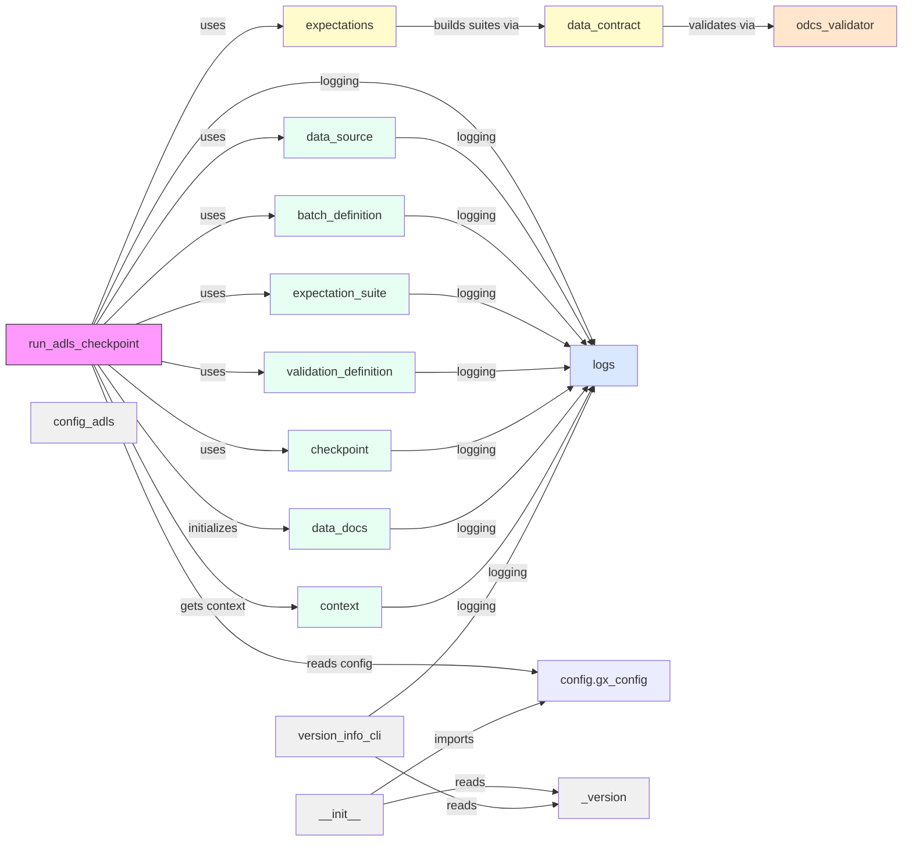

<!-- Dependency diagram for dq_docker package generated as Mermaid markup -->

# dq_docker dependency diagram

Notes
- This diagram shows internal module dependencies within the `dq_docker` package (only intra-package imports and relations). It intentionally omits external libraries (Great Expectations, Azure SDKs, Pandas) for clarity.

External dependencies and extras

- Core runtime deps: `requirements.txt` — generated from `pyproject.toml` and used for normal runtime images.
- Dev deps: `requirements-dev.txt` — development and test dependencies used by CI and local development environments.
- ADLS extras: `requirements-adls.txt` — optional dependencies required for Azure Data Lake Storage (adlfs/fsspec). CI installs this file only when `RUN_ADLS_TESTS=true` to keep default CI runs lightweight.
- Delta extras: `requirements-delta.txt` — optional dependencies for Delta Lake (`deltalake`, `pyarrow`) when needed.

Notes on packaging & CI

- The repository generates pinned `requirements*.txt` files from `pyproject.toml` using `.github/scripts/generate_requirements.py`. Keep `pyproject.toml` canonical; regenerate requirements when you update dependencies.
- The `Dockerfile` and `buildit.sh` support selecting a requirements file via the build-arg/ENV `REQUIREMENTS_FILE` so you can build a slim runtime image or a dev image with extra packages.
- To avoid accidentally baking local Great Expectations artifacts into production images, the repo excludes `gx/` via `.dockerignore` and Dockerfile build patterns; mount `gx/` at runtime for development workflows.

If you maintain or change extras, update `requirements-*.txt` and verify CI with `RUN_ADLS_TESTS=true` when ADLS changes are relevant.
